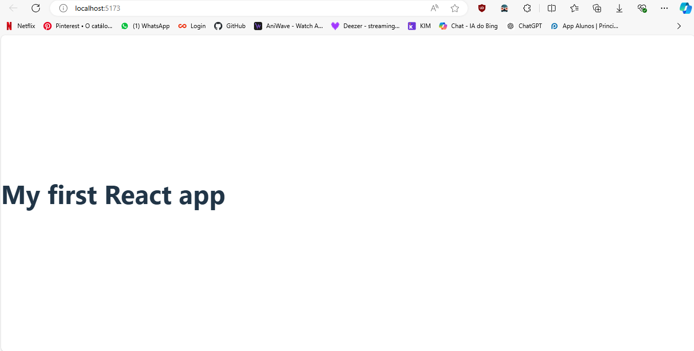

# React
React é uma biblioteca JavaScript para criar interfaces de usuário. É mantido pelo Facebook e por uma comunidade de desenvolvedores individuais e empresas. O React pode ser usado como uma base no desenvolvimento de aplicativos de página única ou móveis.

1. [Instalação](#instalação)
   * [A maneira que aprendi](#a-maneira-que-aprendi)
2. [Características](#características)
    * [JSX (JavaScript Syntax Extension)](#1-jsx-javascript-syntax-extension)
    * [Virtual DOM (Document Object Model)](#2-virtual-dom-document-object-model)
    * [One-way Data Binding (Encademento de Dados de um sentido)](#3-one-way-data-binding-encademento-de-dados-de-um-sentido)
    * [Extensível](#4-extensível)
    * [Componentes](#5-componentes)
3. [Conceitos Core do React](#conceitos-core-do-react)
4. [Componentes](#componentes)
    * [Maneiras de estilizar um componente](#maneiras-de-estilizar-um-componente)
5. [Props](#props)

## Instalação
Para instalar o React, você precisa ter o Node.js instalado em sua máquina. O Node.js é uma plataforma construída sobre o motor JavaScript do Chrome para facilmente construir aplicações de rede rápidas e escaláveis. Você pode baixar o Node.js em [nodejs.org](https://nodejs.org/).

Depois de instalar o Node.js, você pode criar um novo projeto React executando o seguinte comando:

```bash
npx create-react-app my-app
```

Este comando cria um novo projeto React em um diretório chamado `my-app`. Para iniciar o projeto, você pode executar o seguinte comando:

```bash
cd my-app
npm start
```

Este comando inicia o servidor de desenvolvimento do React e abre o projeto no seu navegador padrão.

Para mais informações sobre o React, você pode acessar o site oficial do React em [reactjs.org](https://reactjs.org/).

### A maneira que aprendi
No curso React Full Course for free ⚛️ (2024)[https://www.youtube.com/watch?v=CgkZ7MvWUAA&list=PLFvqzE00hvPcpMRs3R-uHi0XF41LlYZ01&index=25&t=118s] do canal Bro Code. Ele iniciou o projeto com os seguintes comandos:

Primeiro ele criou o projeto com o comando:
```bash
npm create vite@latest
```

Que gerou uma espécie de formulário para a criação do projeto.

A primeira linha foi:
```bash
Project name: >> vite-project -- Por padrão o nome do projeto é vite-project, mas você pode mudar.
```

Depois aparece as opções de framework:
```bash
Vanilla
Vue
React -- Escolha React
Lit
Svelte
Solid
Qwik
Others
```

Depois aparece as opções de linguagem:
```bash
TypeScript
TypeScript + SWC
JavaScript -- Escolhi JavaScript
JavaScript + SWC
```

E os ultimos comandos são:
```bash
cd vite-project
npm install
npm run dev
```

Essa maneira de criar o projeto ultiliza o Vite, que é um build tool para o desenvolvimento de projetos web modernos. Ele é muito mais rápido que o Webpack e o Parcel. Para mais informações sobre o Vite, você pode acessar o site oficial do Vite em [vitejs.dev](https://vitejs.dev/).

Para Reiniciar o servidor nas duas maneiras é:

Para a primeira maneira:
```bash
cd my-app
npm start
```

Para a segunda maneira:
```bash
cd vite-project
npm run dev
```

## Características
### 1. JSX (JavaScript Syntax Extension)
<ul>
    <li>JSX é uma extensão de sintaxe JavaScript que permite escrever HTML dentro do JavaScript.</li>
    <li>JSX é semelhante ao XML/HTML.</li>
    <li>JSX é uma sintaxe mais fácil e rápida para escrever elementos React.</li>
</ul>

**Exemplo:**
```jsx
const name = "My first React app";
const ele = <h1>Welcome to {name}</h1>;
```

### 2. Virtual DOM (Document Object Model)
<ul>
    <li>O Virtual DOM é uma representação do DOM em memória.</li>
    <li>O Virtual DOM é uma abstração do DOM.</li>
    <li>O Virtual DOM é mais rápido que o DOM real.</li>
    <li>O Virtual DOM é atualizado automaticamente.</li>
</ul>

### 3. One-way Data Binding (Encademento de Dados de um sentido)
<ul>
    <li>React usa o encademento de dados de um sentido.</li>
    <li>Em React, dados vão do componente pai para o filho</li>
    <li>Os componentes filhos não podem retornar dados para os seus componentes pais, mas podem comunicar com eles para modificar estados baseados em inputs providenciadas</li>
</ul>

### 4. Extensível
<ul>
    <li>React é uma biblioteca extensível.</li>
    <li>Você pode adicionar funcionalidades adicionais usando plugins.</li>
    <li>Você pode usar ferramentas como Redux, Flux e React Native</li>
</ul>

### 5. Componentes
<ul>
    <li>Componentes são blocos de construção de uma aplicação React.</li>
    <li>Um componente é uma parte reutilizável de uma interface de usuário.</li>
    <li>Um componente pode ser uma função ou uma classe.</li>
    <li>Um componente pode ser uma parte de outro componente.</li>
</ul>

## Conceitos Core do React
<ul>
    <li><strong>Props:</strong> Componentes podem receber dados de componentes pai por meio de props, permitindo que você passe informações e personalize o comportamento do componente.</li>
    <li><strong>State:</strong> Os componentes podem gerenciar seu estado interno usando o gancho <i>useState</i>. Esse estado dita a aparência e o comportamento do componente, e as atualizações disparam re-renderizações.</li>
    <li><strong>Metodos Lifecycles:</strong> O React fornece métodos de ciclo de vida como <i>componentDidMount</i> e <i>componentDidUpdate</i> que permitem executar ações em estágios específicos do ciclo de vida de um componente.</li>
    <li><strong>Renderização condicional:</strong> Controle o que é exibido na tela com base em determinadas condições usando instruções condicionais no JSX..</li>
</ul>

## Componentes
Componentes são blocos de codigos reutilizáveis que podem ser usados para construir interfaces de usuário retornando HTMl via JSX. Eles podem ser funções ou classes.

Uma interface do usuário é dividida em várias partes individuais chamadas componentes. Você pode trabalhar em componentes de forma independente e, em seguida, mesclá-los todos em um componente pai que será sua interface do usuário final. 

Os componentes promovem eficiência e escalabilidade no desenvolvimento web, permitindo que os desenvolvedores os componham, combinem e personalizem conforme necessário.

Você pode ver na imagem abaixo que dividimos a interface do usuário da página inicial do GeeksforGeeks em componentes individuais.

</a>

Um component simples:
```jsx
function Header() {
  return (
    <header>
      <h1>My first React app</h1>
    </header>
  );
}

export default Header// Exporta o componente para ser usado em outro componente
```

Que é usado em outro componente:
```jsx
import Header from './Header';

function App() {
  return(
    <Header/>
  );
}

export default App
```

</a>

Um componente pode apenas retornar um elemento. Se você quiser retornar mais de um elemento, você pode usar um fragmento ou um elemento pai.

Usando um fragmento:
```jsx
function Header() {
  return (
    <>
      <header>
        <h1>My first React app</h1>
      </header>
      <nav>
        <ul>
          <li>Home</li>
          <li>About</li>
          <li>Contact</li>
        </ul>
      </nav>
    </>
  );
}

export default Header
```

***Obs:*** Comando para criar um componente adquirido pela extensão ES7 React/Redux/GraphQL/React-Native snippets do VSCode:
```jsx
rfce
```
***Obs:*** Classes em jsx são chamadas de className, pois class é uma palavra reservada do JavaScript.

### Maneiras de estilizar um componente
1. CSS Externo
Criar uma arquivo css e importar no componente

```jsx
import './Header.css';

function Header() {
  return (
    <header>
      <h1>My first React app</h1>
    </header>
  );
}

export default Header
```

2. CSS em linha
Criar um objeto com as propriedades css e passar para o style do componente

```jsx
function Header() {
    const headerStyle = {
        backgroundColor: 'black',
        color: 'white',
    };

  return (
    <header style={headerStyle}>
      <h1>My first React app</h1>
    </header>
  );
}

export default Header
```

3. CSS Modules
Criar uma pasta css com o nome do componente e criar um arquivo css com o nome do componente.module.css

```jsx
import styles from './Header.module.css';

function Header() {
  return (
    <header className={styles.header}>
      <h1>My first React app</h1>
    </header>
  );
}

export default Header
```

## Props
Props são proprieadades read-only que são passadas entre componentes. Eles são usados para passar dados de um componente pai para um componente filho. O formato é: &lt;Componente prop1="value1" prop2="value2" /&gt;

```jsx
function Header(props) {
  return (
    <header>
      <h1>{props.title}</h1>
    </header>
  );
}

export default Header
```

```jsx
import Header from './Header';

function App() {
  return(
    <Header title="My first React app"/>
  );
}

export default App
```

### propTypes
Mecanismo que assegura que os dados passados sejam do tipo correto. Para usar o propTypes, você precisa importar a biblioteca prop-types.

```jsx
import PropTypes from 'prop-types';

function Header(props) {
  return (
    <header>
      <h1>{props.title}</h1>
    </header>
  );
}

Header.propTypes = {
  title: PropTypes.string
};

export default Header
```

### defaultProps
Define valores padrões para as props.

```jsx
function Header(props) {
  return (
    <header>
      <h1>{props.title}</h1>
    </header>
  );
}

Header.defaultProps = {
  title: 'My first React app'
};

export default Header
```

## Conditional Rendering
Renderização condicional é uma técnica usada para renderizar diferentes elementos com base em uma condição. Você pode usar instruções condicionais como if, else e switch para renderizar diferentes elementos.

```jsx
function Header(props) {
  return (
    <header>
      {props.isLoggedIn ? <h1>Welcome, User</h1> : <h1>Welcome, Guest</h1>}
    </header>
  );
}

export default Header
```

```jsx
import Header from './Header';

function App() {
  return(
    <Header isLoggedIn={true}/>
  );
}

export default App
```