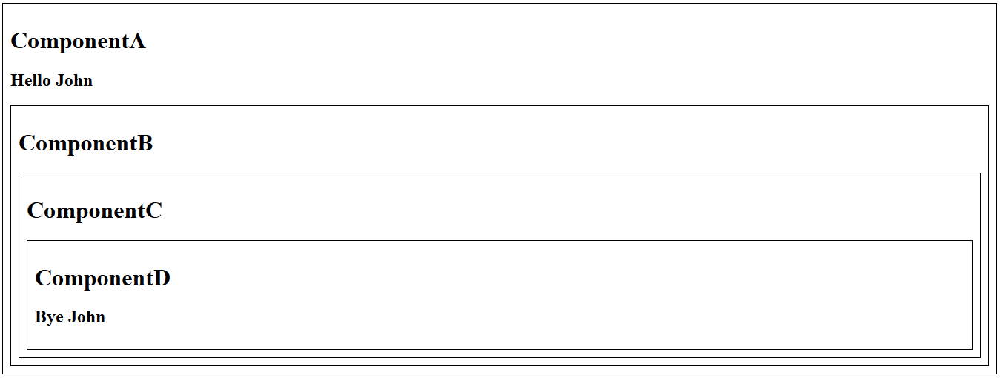

Aqui eu coloco o que aprendi sobre React, uma biblioteca JavaScript para criar interfaces de usuário.

Minhas fontes foram os cursos [React Full Course for free ⚛️ (2024)](https://youtu.be/CgkZ7MvWUAA?si=jVcV3EVU6baYCm74) do canal Bro Code, [React Crash Course 2024](https://youtu.be/LDB4uaJ87e0?si=kX1QY6W7fDN6cZcl), o site [geeksforgeeks](https://www.geeksforgeeks.org/react-tutorial/) e o site [reactjs.org](https://reactjs.org/).

# React
React é uma biblioteca JavaScript para criar interfaces de usuário. Ele foi desenvolvido pelo Facebook em 2011 e lançado em 2013. React é a biblioteca JavaScript mais popular e é usada por empresas como Facebook, Instagram, Netflix, Airbnb, Twitter e Uber.

## Por que usar React?
React permite a criação de websites e aplicações web interativas e dinâmicas. Bastante rápido, especialmente com o novo compilador do React 19.

Além disso, o React possui um grande eco-sistema de bibliotecas e ferramentas, como o Next.js e o React Native. O React pode ser dito como o melhor framework para conseguir um emprego.

1. [Instalação](#instalação)
   * [A maneira que aprendi](#a-maneira-que-aprendi)
2. [Características](#características)
    * [JSX (JavaScript Syntax Extension)](#1-jsx-javascript-syntax-extension)
    * [Virtual DOM (Document Object Model)](#2-virtual-dom-document-object-model)
    * [One-way Data Binding (Encademento de Dados de um sentido)](#3-one-way-data-binding-encademento-de-dados-de-um-sentido)
    * [Extensível](#4-extensível)
    * [Componentes](#5-componentes)
3. [Conceitos Core do React](#conceitos-core-do-react)
4. [Componentes](#componentes)
    * [Maneiras de estilizar um componente](#maneiras-de-estilizar-um-componente)
5. [Props](#props)
    * [propTypes](#proptypes)
    * [defaultProps](#defaultprops)
6. [Conditional Rendering](#conditional-rendering)
7. [Renderização de Listas](#renderização-de-listas)
    * [Lista de objetos](#lista-de-objetos)
    * [Ordenação de listas](#ordenação-de-listas)
    * [Filtragem de listas](#filtragem-de-listas)
    * [Lista de objetos com componentes](#lista-de-objetos-com-componentes)
8. [Update Fuctions](#update-fuctions)
9. [Hooks](#hooks)
    * [Tipos de Hooks](#tipos-de-hooks)
    * [State Hook](#state-hook)
        * [useChange](#usechange)
        * [Updating um objeto](#updating-um-objeto)
        * [Updating um array](#updating-um-array)
        * [Updating um array de objetos](#updating-um-array-de-objetos)
    * [Effect Hook](#effect-hook)

## Instalação
Para instalar o React, você precisa ter o Node.js instalado em sua máquina. O Node.js é uma plataforma construída sobre o motor JavaScript do Chrome para facilmente construir aplicações de rede rápidas e escaláveis. Você pode baixar o Node.js em [nodejs.org](https://nodejs.org/).

Depois de instalar o Node.js, você pode criar um novo projeto React executando o seguinte comando:

```bash
npx create-react-app my-app
```

Este comando cria um novo projeto React em um diretório chamado `my-app`. Para iniciar o projeto, você pode executar o seguinte comando:

```bash
cd my-app
npm start
```

Este comando inicia o servidor de desenvolvimento do React e abre o projeto no seu navegador padrão.

Para mais informações sobre o React, você pode acessar o site oficial do React em [reactjs.org](https://reactjs.org/).

### A maneira que aprendi
No curso React Full Course for free ⚛️ (2024)[https://www.youtube.com/watch?v=CgkZ7MvWUAA&list=PLFvqzE00hvPcpMRs3R-uHi0XF41LlYZ01&index=25&t=118s] do canal Bro Code. Ele iniciou o projeto com os seguintes comandos:

Primeiro ele criou o projeto com o comando:
```bash
npm create vite@latest
```

Que gerou uma espécie de formulário para a criação do projeto.

A primeira linha foi:
```bash
Project name: >> vite-project -- Por padrão o nome do projeto é vite-project, mas você pode mudar.
```

Depois aparece as opções de framework:
```bash
Vanilla
Vue
React -- Escolha React
Lit
Svelte
Solid
Qwik
Others
```

Depois aparece as opções de linguagem:
```bash
TypeScript
TypeScript + SWC
JavaScript -- Escolhi JavaScript
JavaScript + SWC
```

E os ultimos comandos são:
```bash
cd vite-project
npm install
npm run dev
```

Essa maneira de criar o projeto ultiliza o Vite, que é um build tool para o desenvolvimento de projetos web modernos. Ele é muito mais rápido que o Webpack e o Parcel. Para mais informações sobre o Vite, você pode acessar o site oficial do Vite em [vitejs.dev](https://vitejs.dev/).

Para Reiniciar o servidor nas duas maneiras é:

Para a primeira maneira:
```bash
cd my-app
npm start
```

Para a segunda maneira:
```bash
cd vite-project
npm run dev
```

## Características
### 1. JSX (JavaScript Syntax Extension)
<ul>
    <li>JSX é uma extensão de sintaxe JavaScript que permite escrever HTML dentro do JavaScript.</li>
    <li>JSX é semelhante ao XML/HTML.</li>
    <li>JSX é uma sintaxe mais fácil e rápida para escrever elementos React.</li>
</ul>

**Exemplo:**
```jsx
const name = "My first React app";
const ele = <h1>Welcome to {name}</h1>;
```

### 2. Virtual DOM (Document Object Model)
<ul>
    <li>O Virtual DOM é uma representação do DOM em memória.</li>
    <li>O Virtual DOM é uma abstração do DOM.</li>
    <li>O Virtual DOM é mais rápido que o DOM real.</li>
    <li>O Virtual DOM é atualizado automaticamente.</li>
</ul>

### 3. One-way Data Binding (Encademento de Dados de um sentido)
<ul>
    <li>React usa o encademento de dados de um sentido.</li>
    <li>Em React, dados vão do componente pai para o filho</li>
    <li>Os componentes filhos não podem retornar dados para os seus componentes pais, mas podem comunicar com eles para modificar estados baseados em inputs providenciadas</li>
</ul>

### 4. Extensível
<ul>
    <li>React é uma biblioteca extensível.</li>
    <li>Você pode adicionar funcionalidades adicionais usando plugins.</li>
    <li>Você pode usar ferramentas como Redux, Flux e React Native</li>
</ul>

### 5. Componentes
<ul>
    <li>Componentes são blocos de construção de uma aplicação React.</li>
    <li>Um componente é uma parte reutilizável de uma interface de usuário.</li>
    <li>Um componente pode ser uma função ou uma classe.</li>
    <li>Um componente pode ser uma parte de outro componente.</li>
</ul>

## Conceitos Core do React
<ul>
    <li><strong>Props:</strong> Componentes podem receber dados de componentes pai por meio de props, permitindo que você passe informações e personalize o comportamento do componente.</li>
    <li><strong>State:</strong> Os componentes podem gerenciar seu estado interno usando o gancho <i>useState</i>. Esse estado dita a aparência e o comportamento do componente, e as atualizações disparam re-renderizações.</li>
    <li><strong>Metodos Lifecycles:</strong> O React fornece métodos de ciclo de vida como <i>componentDidMount</i> e <i>componentDidUpdate</i> que permitem executar ações em estágios específicos do ciclo de vida de um componente.</li>
    <li><strong>Renderização condicional:</strong> Controle o que é exibido na tela com base em determinadas condições usando instruções condicionais no JSX..</li>
</ul>

## Componentes
Componentes são blocos de codigos reutilizáveis que podem ser usados para construir interfaces de usuário retornando HTMl via JSX. Eles podem ser funções ou classes.

Uma interface do usuário é dividida em várias partes individuais chamadas componentes. Você pode trabalhar em componentes de forma independente e, em seguida, mesclá-los todos em um componente pai que será sua interface do usuário final. 

Os componentes promovem eficiência e escalabilidade no desenvolvimento web, permitindo que os desenvolvedores os componham, combinem e personalizem conforme necessário.

Você pode ver na imagem abaixo que dividimos a interface do usuário da página inicial do GeeksforGeeks em componentes individuais.

</a>

Um component simples:
```jsx
function Header() {
  return (
    <header>
      <h1>My first React app</h1>
    </header>
  );
}

export default Header// Exporta o componente para ser usado em outro componente
```

Que é usado em outro componente:
```jsx
import Header from './Header';

function App() {
  return(
    <Header/>
  );
}

export default App
```

</a>

Um componente pode apenas retornar um elemento. Se você quiser retornar mais de um elemento, você pode usar um fragmento ou um elemento pai.

Usando um fragmento:
```jsx
function Header() {
  return (
    <>
      <header>
        <h1>My first React app</h1>
      </header>
      <nav>
        <ul>
          <li>Home</li>
          <li>About</li>
          <li>Contact</li>
        </ul>
      </nav>
    </>
  );
}

export default Header
```

***Obs:*** Comando para criar um componente adquirido pela extensão ES7 React/Redux/GraphQL/React-Native snippets do VSCode:
```jsx
rfce
```
***Obs:*** Classes em jsx são chamadas de className, pois class é uma palavra reservada do JavaScript.

### Maneiras de estilizar um componente
1. CSS Externo
Criar uma arquivo css e importar no componente

```jsx
import './Header.css';

function Header() {
  return (
    <header>
      <h1>My first React app</h1>
    </header>
  );
}

export default Header
```

2. CSS em linha
Criar um objeto com as propriedades css e passar para o style do componente

```jsx
function Header() {
    const headerStyle = {
        backgroundColor: 'black',
        color: 'white',
    };

  return (
    <header style={headerStyle}>
      <h1>My first React app</h1>
    </header>
  );
}

export default Header
```

3. CSS Modules
Criar uma pasta css com o nome do componente e criar um arquivo css com o nome do componente.module.css

```jsx
import styles from './Header.module.css';

function Header() {
  return (
    <header className={styles.header}>
      <h1>My first React app</h1>
    </header>
  );
}

export default Header
```

## Props
Props são proprieadades read-only que são passadas entre componentes. Eles são usados para passar dados de um componente pai para um componente filho. O formato é: &lt;Componente prop1="value1" prop2="value2" /&gt;

```jsx
function Header(props) {
  return (
    <header>
      <h1>{props.title}</h1>
    </header>
  );
}

export default Header
```

```jsx
import Header from './Header';

function App() {
  return(
    <Header title="My first React app"/>
  );
}

export default App
```

### propTypes
Mecanismo que assegura que os dados passados sejam do tipo correto. Para usar o propTypes, você precisa importar a biblioteca prop-types.

```jsx
import PropTypes from 'prop-types';

function Header(props) {
  return (
    <header>
      <h1>{props.title}</h1>
    </header>
  );
}

Header.propTypes = {
  title: PropTypes.string
};

export default Header
```

### defaultProps
Define valores padrões para as props.

```jsx
function Header(props) {
  return (
    <header>
      <h1>{props.title}</h1>
    </header>
  );
}

Header.defaultProps = {
  title: 'My first React app'
};

export default Header
```

## Conditional Rendering
Renderização condicional é uma técnica usada para renderizar diferentes elementos com base em uma condição. Você pode usar instruções condicionais como if, else e switch para renderizar diferentes elementos.

```jsx
function Header(props) {
  return (
    <header>
      {props.isLoggedIn ? <h1>Welcome, User</h1> : <h1>Welcome, Guest</h1>}
    </header>
  );
}

export default Header
```

```jsx
import Header from './Header';

function App() {
  return(
    <Header isLoggedIn={true}/>
  );
}

export default App
```

## Renderização de Listas
Você pode renderizar listas de elementos usando o método map().

```jsx
function List() {

    const items = ['Item 1', 'Item 2', 'Item 3'];

  return (
    <ul>
      {items.map((item, index) => (
        <li key={index}>{item}</li>
      ))}
    </ul>
  );
}

export default List
```

<b>Key</b> é uma propriedade especial que você precisa incluir ao criar listas de elementos. Ele ajuda o React a identificar quais itens foram alterados, adicionados ou removidos.

Id costuma ser a melhor propriedade para ser usada como key.

```jsx
import List from './List';

function App() {
  return(
    <List/>
  );
}

export default App
```

### Lista de objetos
```jsx
function List() {

    const items = [
        {id: 1, name: 'Item 1', price: 100},
        {id: 2, name: 'Item 2', price: 200},
        {id: 3, name: 'Item 3', price: 300}
    ];

  return (
    <ul>
      {items.map((item) => (
        <li key={item.id}>{item.name} - {item.price}</li>
      ))}
    </ul>
  );
}

export default List
```

### Ordenação de listas
```jsx
function List() {

    const items = [
        {id: 1, name: 'Item 1', price: 100},
        {id: 2, name: 'Item 2', price: 200},
        {id: 3, name: 'Item 3', price: 300}
    ];

    items.sort((a, b) => a.price - b.price);// Ordena a lista pelo preço
    // items.sort((a, b) => b.price - a.price);// Ordena a lista pelo preço de forma decrescente
    // items.sort((a, b) => a.name.localeCompare(b.name));// Ordena a lista pelo nome
    // items.sort((a, b) => b.name.localeCompare(a.name));// Ordena a lista pelo nome de forma decrescente

  return (
    <ul>
      {items.map((item) => (
        <li key={item.id}>{item.name} - {item.price}</li>
      ))}
    </ul>
  );
}

export default List
```

### Filtragem de listas
```jsx
function List() {

    const items = [
        {id: 1, name: 'Item 1', price: 100},
        {id: 2, name: 'Item 2', price: 200},
        {id: 3, name: 'Item 3', price: 300}
    ];

    const filteredItems = items.filter((item) => item.price > 150);// Filtra os itens com preço maior que 150

  return (
    <ul>
      {filteredItems.map((item) => (
        <li key={item.id}>{item.name} - {item.price}</li>
      ))}
    </ul>
  );
}

export default List
```

### Lista de objetos com componentes
```jsx
import List from "./List";

function App() {

    const items = [
        {id: 1, name: 'Item 1', price: 100},
        {id: 2, name: 'Item 2', price: 200},
        {id: 3, name: 'Item 3', price: 300}
    ];

    return (
        <List itens={items}/>
    );
}

export default App
```

```jsx
function List(props) {

    const itensLista = props.itens;

    const lista = itensLista.map((item) => (
        <li key={item.id}>{item.name} - {item.price} reais</li>
    ));

    return (
        <ul>
            {lista}
        </ul>
    );
}

export default List
```

## Update Fuctions
Update functions são funções que atualizam o estado de um componente. Já que o react não permite a atualização direta do estado, você precisa usar uma função para atualizar o estado.

```jsx
import React, { useState } from 'react';

function Counter() {

    const [count, setCount] = useState(0);

    const increment = () => {
        setCount((prevCount) => prevCount + 1);
    }

    const decrement = () => {
        setCount((prevCount) => prevCount - 1);
    }

    return (
        <div>
            <h1>{count}</h1>
            <button onClick={increment}>Increment</button>
            <button onClick={decrement}>Decrement</button>
        </div>
    );
}

export default Counter
```

Dessa forma, você garante que o estado é atualizado de forma correta. Se por exemplo, você colocar diversos setCount(count + 1) em um evento, o React não garante que o estado será atualizado de forma correta.

## Hooks
Hooks são funções que permitem que você use o estado e outros recursos do React em componentes de função. Eles permitem que você use o estado e outros recursos do React sem escrever uma classe.

```jsx
import React, { useState } from 'react';

function Counter() {

    const [count, setCount] = useState(0);

    return (
        <div>
            <h1>{count}</h1>
            <button onClick={() => setCount(count + 1)}>Increment</button>
        </div>
    );
}

export default Counter
```

***Nota:*** 
Hooks  não funcionam em  classes.

### Tipos de Hooks
1. State Hook
2. Effect Hook
3. Context Hook
4. Ref Hook
5. Performance Hook
6. Reducer Hook
7. Other Hooks
8. Custom Hooks

### State Hook
O State Hook permite que você adicione estado a um componente de função.

```jsx
import React, { useState } from 'react';

function Counter() {

    const [count, setCount] = useState(0);

    return (
        <div>
            <h1>{count}</h1>
            <button onClick={() => setCount(count + 1)}>Increment</button>
        </div>
    );
}

export default Counter
```

#### useChange
Com o useChange você pode modificar o estado de um elemento enquanto o digita.

```jsx
import React, { useState } from 'react';

function Input() {

     const [name, setName] = useState();

    return (
        <input type="text" onChange={(e) => setName(e.target.value)} />
        <h2>{name}</h2>
    );
}

export default Input
```

#### Updating um objeto
```jsx
import React, { useState } from 'react';

function Object() {

    const [person, setPerson] = useState({name: 'John', age: 25});

    const handleNameChange = (e) => {
        setPerson(p => ({...p, name: e.target.value}));
    }

    const handleAgeChange = (e) => {
        setPerson(p => ({...p, age: e.target.value}));
    }

    return (
        <div>
            <h1>{person.name} - {person.age}</h1>
            <button onClick={() => setPerson({name: 'Doe', age: 30})}>Update</button>

            // Ou

            <input type="text" value={person.name} onChange={handleNameChange} />
            <input type="number" value={person.age} onChange={handleAgeChange} />

        </div>
    );
}

export default Object
```

#### Updating um array
```jsx
import React, { useState } from 'react';

function Array() {

    const [food, setFood] = React.useState(["apple", "banana", "cherry", "date", "elderberry"]);

    const addFood = () => {
        const newfood = document.getElementById('foodInput').value;
        setFood([...food, newfood]);
    }

    const removeFood = (index) => {
        const newFood = food.filter((item, i) => i !== index);
        setFood(newFood);
    }

  return (
    <div>
        <h2>List of Food</h2>

        <ul>
            {food.map((item, index) => (
                <li key={index} onClick={() => removeFood(index)}>{item}</li>
            ))}
        </ul>
        <input type="text" id='foodInput' placeholder='Enter food name'/>
        <button onClick={addFood}>Add Food</button>

    </div>
  )
}

export default Array
```

#### Updating um array de objetos
```jsx
import React, { useState } from 'react';

function ArrayObject() {

    const [people, setPeople] = React.useState([
        {name: 'John', age: 25},
        {name: 'Doe', age: 30},
        {name: 'Jane', age: 35}
    ]);

    const addPerson = () => {
        const name = document.getElementById('nameInput').value;
        const age = document.getElementById('ageInput').value;
        setPeople([...people, {name: name, age: age}]);
    }

    const removePerson = (index) => {
        const newPeople = people.filter((person, i) => i !== index);
        setPeople(newPeople);
    }

  return (
    <div>
        <h2>List of People</h2>

        <ul>
            {people.map((person, index) => (
                <li key={index} onClick={() => removePerson(index)}>{person.name} - {person.age}</li>
            ))}
        </ul>
        <input type="text" id='nameInput' placeholder='Enter name'/>
        <input type="number" id='ageInput' placeholder='Enter age'/>
        <button onClick={addPerson}>Add Person</button>

    </div>
  )
}

export default ArrayObject
```

### Effect Hook
O Effect Hook permite que você execute efeitos secundários em componentes de função. Efeitos secundários são operações que não podem ser realizadas durante a renderização.

```jsx
import React, { useState, useEffect } from 'react';

function Counter() {

    const [count, setCount] = useState(0);

    useEffect(() => {
        document.title = `Count: ${count}`;// Atualiza o título da página
    }, [count]);// Executa o efeito sempre que o count mudar

    return (
        <div>
            <h1>{count}</h1>
            <button onClick={() => setCount(count + 1)}>Increment</button>
        </div>
    );
}

export default Counter
```

O segundo argumento do useEffect é uma lista de dependências. Se você passar uma lista vazia, o efeito será executado apenas uma vez após a renderização inicial. Se você passar uma variável, o efeito será executado sempre que a variável mudar. Se você não passar um segundo argumento, o efeito será executado após cada renderização.

***Nota:***
O useEffect é executado após a renderização do componente.

***Nota:***
Se você retornar uma função no useEffect, ela será executada antes do próximo efeito.

### useContext
É um hook que permite a você passar dados através da árvore de componentes sem ter que passar props manualmente em cada nível.

```jsx
import React, {useState, createContext} from 'react';
import ComponentB from '../ComponentB';

export const UserContext = createContext();

function ComponentA() {

    const [user, setUser] = useState("John");

  return (
    <div className='box'>
        <h1>ComponentA</h1>
        <h2>{`Hello ${user}`}</h2>
        <UserContext.Provider value={{user}}>
            <ComponentB user={user}/>
        </UserContext.Provider>
    </div>
  )
}

export default ComponentA
```

```jsx
import React, {useContext} from 'react';
import {UserContext} from '../ComponentA';

function ComponentD() {

    const user = useContext(UserContext)

  return (
    <div className='box'>
        <h1>ComponentD</h1>
        <h2>{`Bye ${user.user}`}</h2>
    </div>
  )
}

export default ComponentD
```

```jsx
import ComponentA from "./ComponentA";

function App() {
    
  return (
    <ComponentA/>
  );
}

export default App
```

***Imagem do resultado:***

</img>

**Props vs Context:**

Props:
- Passa dados de um componente pai para um componente filho.
- Bom para passar dados para componentes filhos.
- Dados são passados manualmente.

Context:
- Passa dados através da árvore de componentes.
- Bom para passar dados para componentes aninhados.
- Dados são passados automaticamente.

### useRef
É um hook que permite a você acessar o DOM de um elemento.

```jsx
import React, {useRef} from 'react';

function Input() {

    const inputRef = useRef();

    const handleClick = () => {
        inputRef.current.focus();
    }

  return (
    <div>
        <input type="text" ref={inputRef}/>
        <button onClick={handleClick}>Focus</button>
    </div>
  )
}

export default Input
```